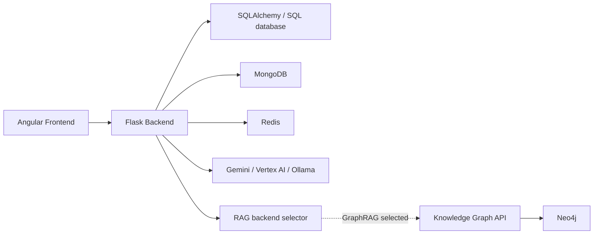

# MIS-Teach Backend

## 專案簡介

MIS-Teach Backend 是核心 Web application 的 Flask 後端。它提供登入與註冊、測驗題庫讀取與提交、自動批改、結果與錯題資料、診斷式學習分析（Diagnostic Learning Analytics, DLA）、AI 教學、RAG backend 切換，以及 GraphRAG proxy。

此 repository 是 [MIS-Teach Parent](https://github.com/THEHAPPYMAN779991/MIS-Teach) 的核心 submodule，也可獨立閱讀與開發。公開版本不提供真實研究題庫、教材、學生資料、資料庫內容、憑證或向量資料。

## 目錄

- [Backend Role](#backend-role)
- [Technology Stack](#technology-stack)
- [研究參考配置與相容模式](#研究參考配置與相容模式)
- [Directory Structure](#directory-structure)
- [Core Modules](#core-modules)
- [Database Dependencies](#database-dependencies)
- [Environment Variables](#environment-variables)
- [Installation](#installation)
- [Startup](#startup)
- [API Overview](#api-overview)
- [RAG](#rag)
- [GraphRAG Integration](#graphrag-integration)
- [Automated Grading, DLA and Tutoring](#automated-grading-dla-and-tutoring)
- [Multi-Agent Standard Answer Generation](#multi-agent-standard-answer-generation)
- [Testing](#testing)
- [Frontend Integration](#frontend-integration)
- [Troubleshooting](#troubleshooting)
- [Security Notes](#security-notes)
- [Documentation / Implementation Inconsistencies](#documentation--implementation-inconsistencies)
- [Related Repositories](#related-repositories)

## Backend Role



`app.py` 註冊 Flask blueprints，並在 application context 初始化 SQL 資料表、測驗與行事曆資料、教學進度、新聞、MongoDB 資料與選用的 Neo4j 連線。Neo4j 連線失敗會被捕捉並略過舊圖譜初始化；這不代表 GraphRAG 功能已可用。

## Technology Stack

| Technology | Source-confirmed version / role |
| --- | --- |
| Flask | `Flask==3.0.3` |
| SQLAlchemy integration | `Flask-SQLAlchemy==3.1.1`、`SQLAlchemy==2.0.36` |
| MongoDB | `Flask-PyMongo==2.3.0`、`pymongo==4.10.1` |
| Redis | `flask-redis==0.4.0`、`redis==5.2.0` |
| Neo4j | `neo4j==5.28.2`；GraphRAG／知識圖譜功能使用 |
| Retrieval | `chromadb==1.0.16`，以及 GraphRAG / pure LLM 的選擇器 |
| AI SDK | Google Generative AI、Vertex AI 相關相依套件與 Ollama 相依套件皆存在於 `requirements.txt` |
| Environment loading | `python-dotenv==1.1.0`，`app.py` 先載入本機 `api.env` |

公開 source 沒有 `pyproject.toml`、`runtime.txt` 或 Python version pin；請使用可安裝 `requirements.txt` 的 Python 環境。資料庫供應商亦由 connection URI 決定，非由公開 source 固定。

## 研究參考配置與相容模式

### Research Reference Configuration

論文的主要研究參考配置是 **Gemini 2.5 Pro via Vertex AI**。這是研究參考環境的說明，不代表所有公開 Backend runtime call sites 都已統一為 Gemini 2.5 Pro。

### Compatibility / Legacy Paths

目前 source 保留多條相容或歷史執行路徑：

- AI Studio / Gemini API compatibility path；
- Ollama compatibility path；
- legacy Gemini model call sites。

實際 provider、認證方式與模型由 `api.env` 及個別呼叫端決定。部署時應依 [Environment Variables](#environment-variables) 設定必要的本機環境變數，而不是在程式碼中加入任何 API key 或 credential。

## Directory Structure

```text
backend/
├── app.py                    # Flask application 與 blueprint 註冊
├── config.py                 # 環境設定、SQL / Mongo / Redis / Neo4j 設定
├── accessories.py            # Flask extensions、AI 與 Neo4j 初始化
├── src/
│   ├── quiz.py               # 題庫選取、測驗建立、提交與結果
│   ├── grade_answer.py       # AI 批改
│   ├── learning_analytics.py # 學習分析 API
│   ├── ai_teacher.py         # AI 教學對話 API
│   ├── question_concept_mapper.py
│   ├── remedial_learning_state.py
│   ├── graphrag_client.py    # GraphRAG strict retrieval client
│   ├── graphrag_proxy.py     # 對 Frontend 暴露 GraphRAG proxy
│   ├── rag_backend.py        # graphrag / chromadb / llm_only 選擇器
│   └── rag_sys/              # 教學提示詞與 RAG orchestration
├── tool/
│   ├── generate_multi_agent_answers.py
│   ├── insert_mongodb.py
│   └── ...                   # 初始化與維護工具
├── tests/                    # unittest test modules
├── requirements.txt
└── .env.example
```

## Core Modules

| File / Module | Responsibility |
| --- | --- |
| `app.py` | 載入 `api.env`、建立 Flask app、設定 CORS、註冊 blueprints、初始化資料服務與 scheduler。 |
| `config.py` | 從環境讀取 Flask security key、SQLAlchemy URI、MongoDB、Redis、Neo4j、Mail 設定。 |
| `accessories.py` | 建立 `SQLAlchemy`、`PyMongo`、`FlaskRedis`、Mail、LoginManager；初始化 Gemini / Vertex AI / Ollama 與 Neo4j driver。 |
| `src/quiz.py` | 取得 MongoDB 題庫 collection、建立與提交測驗、回傳結果；預設 source 為 `test5`。 |
| `src/ai_quiz.py` | AI 相關測驗、引導式學習與提交流程 API。 |
| `src/grade_answer.py` | 批次 AI 批改與圖片／文字處理的批改支援。 |
| `src/learning_analytics.py` | AI 診斷、難度與遺忘分析、練習相關 API。 |
| `src/ai_teacher.py` | 取得測驗結果並提供 AI 教學對話端點。 |
| `src/question_concept_mapper.py` | 問題與概念的向量／語意映射設定。 |
| `src/remedial_learning_state.py` | 補救學習狀態支援；test 顯示 legacy stateful mode 與目前 one-shot default 皆存在。 |
| `src/rag_backend.py` | 提供 `graphrag`、`chromadb`、`llm_only` 的 runtime / request-level backend 選擇。 |
| `src/graphrag_client.py` | 對 Knowledge Graph API 與 Neo4j 取得 Seed、先備概念、Chunk 與 strict policy evidence。 |
| `src/graphrag_proxy.py` | 讓 Frontend 從 `/api/graphrag` 使用搜尋、概念圖、路徑、教材位置與問答。 |
| `tool/generate_multi_agent_answers.py` | 主代理、覆核代理與仲裁代理的標準答案產生工具，輸出決策來源與報告。 |

## Database Dependencies

| Service | Requirement | Source evidence |
| --- | --- | --- |
| SQL database | 核心功能需要 | `app.py` 在 application context 呼叫 `sqldb.create_all()`，並初始化測驗、行事曆與教學進度資料。 |
| MongoDB | 登入與題庫流程需要 | `accessories.py` 建立 `PyMongo`；`login.py` 查詢 user collection；`quiz.py` 從 MongoDB collection 讀取題庫。 |
| Redis | 應用程式會初始化 | `accessories.py` 建立兩個 `FlaskRedis` client；`app.py` scheduler 使用 Redis list 處理通知。 |
| Neo4j | GraphRAG / 知識圖譜功能需要 | `accessories.py` 與 `graphrag_client.py` 使用 Neo4j driver。 |
| ChromaDB | 僅當 RAG backend 設為 `chromadb` | `src/rag_backend.py` 定義此模式；`src/chromadb_rag.py` 使用 collection。 |

### 題庫資料政策

`src/quiz.py` 接受 collection 或 `database.collection` 格式的題庫來源，並以 `MIS_DEFAULT_QUESTION_SOURCE` 決定預設 collection；未設定時是 `test5`。`app.py` 的 MongoDB bootstrap 會尋找一個未公開的本機資料檔；公開版本沒有該研究資料，因此部署者必須自行建立合法、匿名或 synthetic 題庫 collection。

## Environment Variables

在 repository 根目錄執行：

```powershell
Copy-Item .env.example api.env
```

macOS / Linux Bash：

```bash
cp .env.example api.env
```

`app.py` 會在匯入主要模組前載入同目錄的 `api.env`。該檔案必須保留在本機且不得提交。

### Core server and data services

| Variable | Required | Purpose | Safe Example |
| --- | --- | --- | --- |
| `FLASK_SECRET_KEY` | 是，除非使用本機 ignored `security_key` | Flask `SECRET_KEY` 與 security salt | `local-development-secret` |
| `SECRET_KEY` | 否 | `FLASK_SECRET_KEY` 的 legacy alias | `local-development-secret` |
| `SQLALCHEMY_DATABASE_URI` | 核心資料表必要 | DevelopmentConfig 的 SQLAlchemy URI | `sqlite:///mis_teach.db` |
| `SQLALCHEMY_DATABASE_URI_PRODUCTION` | 依 production config | ProductionConfig 優先使用的 URI | `sqlite:///mis_teach_prod.db` |
| `MONGO_URI` | 題庫與登入必要 | MongoDB 連線 | `mongodb://localhost:27017` |
| `MONGO_DB_NAME` | 否 | MongoDB database，default `MIS_Teach` | `MIS_Teach` |
| `REDIS_URL` | 依部署功能 | Redis client 設定 | `redis://localhost:6379/0` |
| `MIS_DEFAULT_QUESTION_SOURCE` | 否 | 預設 MongoDB 題庫 collection | `demo_questions` |
| `MAIL_USERNAME`、`MAIL_PASSWORD`、`MAIL_DEFAULT_SENDER` | 寄信功能才需要 | Flask-Mail 設定 | 使用本機專屬設定 |
| `LINE_CHANNEL_ACCESS_TOKEN`、`LINE_CHANNEL_SECRET` | LINE 整合才需要 | LINE Bot API | 使用本機專屬設定 |

### AI provider

| Variable | Required | Purpose | Safe Example |
| --- | --- | --- | --- |
| `AI_PROVIDER` | AI 功能需要時選用 | 可強制 `vertex`、`gemini`、`aistudio` 或 `ollama` 路徑 | `vertex` |
| `GEMINI_BACKEND` | Gemini 路徑選用 | 選擇 Gemini backend，例如 Vertex | `vertex` |
| `VERTEX_PROJECT`、`VERTEX_LOCATION` | Vertex AI 時必要 | Vertex project 與 location | `YOUR_PROJECT_ID`、`us-central1` |
| `GOOGLE_CLOUD_PROJECT` | Vertex fallback 選用 | `VERTEX_PROJECT` 的 fallback project 名稱 | `YOUR_PROJECT_ID` |
| `GEMINI_API_KEY` | AI Studio 時可用 | 單一 Gemini API key | 由本機自行填入 |
| `GEMINI_API_KEYS`、`WU_API_KEYS`、`PAN_API_KEYS`、`AI_API_KEYS` | 多 key 管理時選用 | 逗號分隔的 key group | 由本機自行填入 |
| `GENAI_API_KEY`、`GOOGLE_API_KEY` | 既有相容設定 | Gemini client 相容變數 | 由本機自行填入 |
| `DEFAULT_API_GROUP` | 多 key 管理選用 | 選擇預設 key group | `gemini_api` |
| `OLLAMA_BASE_URL` | Ollama 時選用 | 本機 Ollama endpoint | `http://localhost:11434` |

`accessories.py` 會根據 `AI_PROVIDER` 與 `GEMINI_BACKEND` 選擇 AI Studio 或 Vertex AI；若選用 Ollama 但本機服務不可用，source 實作會嘗試回退到 Gemini。呼叫端模型也不完全一致：一般 `init_ai()` 的 Gemini default 是 `gemini-2.5-flash`，而 legacy multi-agent tool 仍出現 Gemini 1.5 / 2.0 Flash 呼叫。故文件不將整個 Backend 描述為固定的 Gemini 2.5 Pro 流程。

### RAG, GraphRAG and assets

| Variable | Required | Purpose | Safe Example |
| --- | --- | --- | --- |
| `RAG_BACKEND` | 否 | 預設 RAG mode：`graphrag`、`chromadb` 或 `llm_only` | `graphrag` |
| `CHROMADB_COLLECTION` | ChromaDB 時選用 | ChromaDB collection 名稱 | `textbook_knowledge` |
| `NEO4J_URI`、`NEO4J_USERNAME`、`NEO4J_PASSWORD`、`NEO4J_DATABASE` | GraphRAG 時必要 | 直接 Neo4j 連線 | `bolt://localhost:7687`、本機專屬帳號資訊 |
| `GRAPHRAG_API_BASE` | GraphRAG 時必要 | Knowledge Graph API base URL | `http://localhost:8001` |
| `GRAPHRAG_DEFAULT_TIMEOUT`、`GRAPHRAG_QUERY_TIMEOUT`、`GRAPHRAG_TRACE_MAX_TEXT` | 否 | GraphRAG request / trace 限制 | 依部署環境設定 |
| `QUESTION_CONCEPT_TOP_K`、`QUESTION_CONCEPT_MAX_CONCEPTS`、`QUESTION_CONCEPT_MIN_SCORE`、`QUESTION_CONCEPT_SCORE_WINDOW`、`QUESTION_CONCEPT_TIMEOUT` | 否 | 題目概念 mapping 的篩選與 timeout | 依實驗設定 |
| `PDF_OUTPUT_JSON_DIR`、`PDF_TEST_IMAGE_DIR`、`PDF_TEMP_ASSETS_DIR`、`PDF_ASSETS_DIR` | 題圖服務時選用 | PDF 轉錄產生的本機 assets 位置 | `D:\\mis-assets` |
| `RAG_EXPERIMENT_MONGO_URI` | RAG 實驗工具時選用 | 與 application 不同的實驗 MongoDB | `mongodb://localhost:27017` |

`.env.example` 另列出 GraphRAG prompt / reranking override。它們預設以註解保留，只有在刻意覆寫程式預設時才設定。

## Installation

在 `backend/` 執行：

```powershell
python -m venv .venv
.\.venv\Scripts\Activate.ps1
pip install -r requirements.txt
Copy-Item .env.example api.env
```

macOS / Linux Bash：

```bash
python3 -m venv .venv
source .venv/bin/activate
python -m pip install -r requirements.txt
cp .env.example api.env
```

接著以文字編輯器填入 `api.env` 中的核心資料服務與 AI provider 設定。不要將 API key、資料庫密碼、token 或 service-account 檔案寫入 source。

## Startup

在 `backend/` 並啟用 virtual environment 後：

```powershell
python app.py
```

macOS / Linux Bash：

```bash
python app.py
```

source 的 entrypoint 是 `app.run(debug=False, use_reloader=False)`，沒有在程式中明確傳入 port。Frontend 的 local environment 預期 Backend API 在 `http://localhost:5000`；請以 Flask 啟動日誌確認實際 binding。`python app.py production` 會讓 `app.py` 選取 `ProductionConfig`，但這不是完整的 production deployment recipe。

## API Overview

下表是由 Flask blueprint 與 Frontend service 對照整理的主要 API 範圍，而非完整 OpenAPI contract。

完整 API 清單請見 [docs/API_REFERENCE.md](docs/API_REFERENCE.md)。該清單由已註冊 Flask Blueprint、`url_prefix` 與 route decorator 靜態整理；Authentication 欄位未經逐端點 runtime 驗證時會明確標為 `Source-dependent / verify implementation`。

| Method | Endpoint | Module | Purpose |
| --- | --- | --- | --- |
| `POST` | `/login/login_user` | `src/login.py` | 以 email 與密碼登入並回傳 session token 資訊。 |
| `POST` | `/register/register_user` | `src/register.py` | 註冊帳號。 |
| `GET` | `/quiz/question-sources` | `src/quiz.py` | 讀取可選題庫來源。 |
| `POST` | `/quiz/get-exam` | `src/quiz.py` | 依題庫來源取得考題。 |
| `POST` | `/quiz/create-quiz` | `src/quiz.py` | 建立測驗。 |
| `POST` | `/quiz/submit-quiz` | `src/quiz.py` | 提交測驗答案。 |
| `GET` | `/quiz/get-quiz-result/<result_id>` | `src/quiz.py` | 讀取測驗結果。 |
| `POST` | `/ai_quiz/submit-quiz` | `src/ai_quiz.py` | AI 測驗提交流程。 |
| `POST` | `/ai_teacher/ai-tutoring` | `src/ai_teacher.py` | AI 補救教學對話。 |
| `POST` | `/api/learning-analytics/ai-diagnosis` | `src/learning_analytics.py` | AI 診斷分析。 |
| `GET` / `POST` | `/api/rag/backend` | `src/rag_backend_api.py` | 查看或切換 RAG backend。 |
| `GET` | `/api/rag/health` | `src/rag_backend_api.py` | RAG backend 狀態。 |
| `GET` / `POST` | `/api/graphrag/...` | `src/graphrag_proxy.py` | 概念搜尋、圖譜、路徑、教材位置與問答 proxy。 |
| `POST` | `/web-ai/chat` | `src/web_ai_assistant.py` | 網頁 AI 助理對話。 |
| `GET` / `POST` | `/note/...` | `src/note.py` | 筆記與重點標記。 |
| `GET` / `POST` | `/dashboard/...` | `src/dashboard.py` | 使用者資料、行事曆與 dashboard 統計。 |

### Synthetic request examples

登入：

```http
POST /login/login_user
Content-Type: application/json

{
  "email": "student@example.test",
  "password": "local-test-value"
}
```

成功回應的資料 shape：

```json
{
  "token": "<signed-token>",
  "new_user": true,
  "guide_completed": false,
  "guide_info": {
    "new_user": true,
    "guide_completed": false
  }
}
```

取得題庫：

```http
POST /quiz/get-exam
Authorization: Bearer <signed-token>
Content-Type: application/json

{
  "question_source": "demo_questions"
}
```

上述 payload 僅示範欄位形狀，不代表 repository 內建 `demo_questions` collection 或真實帳號。

## RAG

`src/rag_backend.py` 的有效 backend 為：

- `graphrag`：預設值；用於 GraphRAG 證據檢索。
- `chromadb`：使用 ChromaDB collection。
- `llm_only`：不呼叫 RAG 的比較 baseline。

RAG backend 可由 `RAG_BACKEND` 設定，也可透過 `/api/rag/backend` 在 runtime 覆寫，或供單次 request 進行比較。`/api/rag/compare` 與 trace endpoints 為研究比較提供記錄介面。

## GraphRAG Integration

GraphRAG 不屬於基本 Flask 啟動的必要條件；它需要配套 [MIS-Teach Knowledge Graph](https://github.com/THEHAPPYMAN779991/MIS-Teach-Knowledge-Graph) 已提供的 API、Neo4j、prepared graph 與 embeddings。

嚴格檢索 policy（`strict_research_policy_v2`）在 `src/graphrag_client.py` 定義為：

1. 以完整原始題目取得最多 5 個 Seed concepts。
2. 對每個 Seed 的所有直接 Chunk 進行題目語意排序，各取最多 3 個，再以完整文字去重。
3. 蒐集這 5 個 Seed 的所有距離 1 `PREREQUISITE_OF` 候選。
4. 以題目與概念名稱／定義的語意分數排序，取前 5 個直接先備 concepts。
5. **僅**由這 5 個先備 concepts 供應所有直接 Chunk，依完整文字去重，再以題目語意排序取前 5 個先備 Chunks。

Frontend 只呼叫 Backend 的 `/api/graphrag` proxy；Browser 不直接連 Neo4j 或 Knowledge Graph API。請在 `api.env` 同時配置 `GRAPHRAG_API_BASE` 與 Neo4j 連線資訊。

## Automated Grading, DLA and Tutoring

- `src/grade_answer.py` 提供批次 AI 批改，並有圖片與文字的 Gemini 呼叫路徑。
- `src/quiz.py` 與 `src/ai_quiz.py` 處理測驗建立、提交、進度與結果資料。
- `src/learning_analytics.py` 提供 AI 診斷、難度分析、遺忘分析與練習相關端點。
- `src/ai_teacher.py` 的 `/ai_teacher/ai-tutoring` 接受授權請求，從 session / request 資料建立教學回覆。
- `src/rag_sys/rag_ai_role.py` 會把選取的 RAG / GraphRAG 證據加入教學提示詞；GraphRAG one-shot / stateful 行為要以目前環境設定與 source default 為準。

`tool/generate_multi_agent_answers.py` 是批次標準答案產生工具，明確實作主代理、覆核代理與仲裁代理；其 CLI default model 是 `gemini-2.5-flash`。此工具不是 Flask request entrypoint。

## Multi-Agent Standard Answer Generation

這是**離線題庫準備工具**，不是 Web runtime service。它接收已經過人工審查的結構化題目 JSON，依序執行：

```text
Structured Question → Primary Agent → Review Agent → Arbitration Agent
                    → answer / detail-answer / difficulty / decision metadata
```

公開的合成輸入範例位於 `examples/demo_multi_agent_input.json`。只驗證題目結構與素材路徑、而不呼叫模型時，可執行：

```powershell
python .\tool\generate_multi_agent_answers.py `
  --input .\examples\demo_multi_agent_input.json `
  --output-dir .\generated\multi_agent_demo `
  --dry-run
```

實際生成會呼叫部署者設定的 AI provider，請移除 `--dry-run`，並只處理你有權使用的題目。成功執行後，輸出目錄包含 `answers.json`、每題的 `agent_traces/` 與 `agent_decision_report.md`；這些輸出均屬 generated data，不應提交。

## Testing

在 `backend/` 並啟用 virtual environment：

```powershell
.\.venv\Scripts\python.exe -m unittest discover -s tests
```

macOS / Linux Bash：

```bash
python -m unittest discover -s tests
```

現有 public tests 覆蓋 GraphRAG Chunk audit 與 reranking、問題概念 mapping、學習分析正規化／概念 mapping、AI 教學結果與公開安全設定。部分 test 使用 mock；是否需外部服務取決於個別測試與環境設定。已排除的研究工具測試與已淘汰的 stateful planner 測試保留於 `tests/legacy/`，不屬於 public release discovery；完整分類請見 [TEST_AUDIT.md](docs/TEST_AUDIT.md)。

## Frontend Integration

Frontend 使用 `environment.apiUrl` 與 `environment.apiBaseUrl` 呼叫此服務。對應配置檔：

- 開發：`frontend/src/environments/environment.dev.ts`
- production：`frontend/src/environments/environment.ts`

重要 Frontend API bases 包含 `/login`、`/register`、`/quiz`、`/ai_quiz`、`/ai_teacher`、`/api/learning-analytics`、`/api/rag`、`/api/graphrag` 與 `/web-ai`。更多畫面與 route 說明請見 [MIS-Teach Frontend](https://github.com/THEHAPPYMAN779991/MIS-Teach-Frontend)。

## Troubleshooting

| Symptom | Check |
| --- | --- |
| `FLASK_SECRET_KEY is not configured` | 建立本機 `api.env` 並設定 `FLASK_SECRET_KEY`；不要提交設定檔。 |
| 題庫或登入失敗 | 確認 MongoDB 正在執行，並檢查 `MONGO_URI`、database、user collection 與題庫 collection。 |
| SQL 初始化失敗 | 檢查 `SQLALCHEMY_DATABASE_URI` 與目標 SQL database 的 schema 權限。 |
| AI 初始化失敗 | 確認 provider 選擇與必要 AI 設定一致；Vertex 路徑需要 project 與 location，AI Studio 路徑需要本機 key。 |
| GraphRAG proxy 無結果 | 依序檢查 Neo4j、圖譜／embedding、Knowledge Graph API、`GRAPHRAG_API_BASE` 和 Neo4j 連線設定。 |
| 題目圖片找不到 | 確認 PDF asset 相關環境變數、run 輸出資料夾與檔名；公開 repo 不包含研究圖片。 |
| Frontend CORS 或 API 失敗 | 確認 Browser origin 受 `app.py` CORS 規則允許，並使 Frontend environment 的 API URL 對應 Flask 實際位址。 |

## Security Notes

- `api.env`、`.env`、`security_key`、credentials、keys、token、真實資料庫 URI 與題庫資料必須保持本機私有。
- `.env.example` 只能保留變數名稱、註解與安全的空值／範例。
- Browser application 不應保存 Gemini、Neo4j、資料庫或其他 server-side secrets。
- 本 README 的 request / response 均為 synthetic example，無真實使用者或研究資料。
- `src/graphrag_client.py` 與 `src/graphrag_proxy.py` 的直接 Neo4j 連線只會讀取 `NEO4J_URI`、`NEO4J_USERNAME` 與 `NEO4J_PASSWORD`。若三者未在本機設定，該選用功能會安全失敗；source 不提供 fallback credential。

## Documentation / Implementation Inconsistencies

公開 source 同時含 Gemini、Vertex AI 與 Ollama provider 分支，且呼叫端模型名稱不完全一致；不能將所有 Backend 功能描述為固定的 Gemini 2.5 Pro via Vertex AI。研究參考配置與相容路徑請見前述章節。
3. 公開 source 的 bootstrap 路徑預期一份未公開的本機題庫檔案；公開部署必須提供自己的合法題庫資料。

## Related Repositories

- [MIS-Teach Parent](https://github.com/THEHAPPYMAN779991/MIS-Teach)
- [MIS-Teach Frontend](https://github.com/THEHAPPYMAN779991/MIS-Teach-Frontend)
- [MIS-Teach Knowledge Graph](https://github.com/THEHAPPYMAN779991/MIS-Teach-Knowledge-Graph)（GraphRAG 配套服務）
- [MIS-Teach Exam Transcription](https://github.com/THEHAPPYMAN779991/MIS-Teach-Exam-Transcription)（離線題庫前處理工具）
